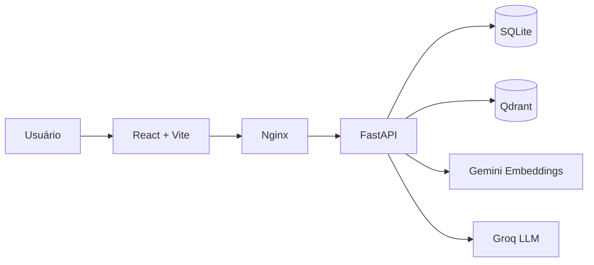
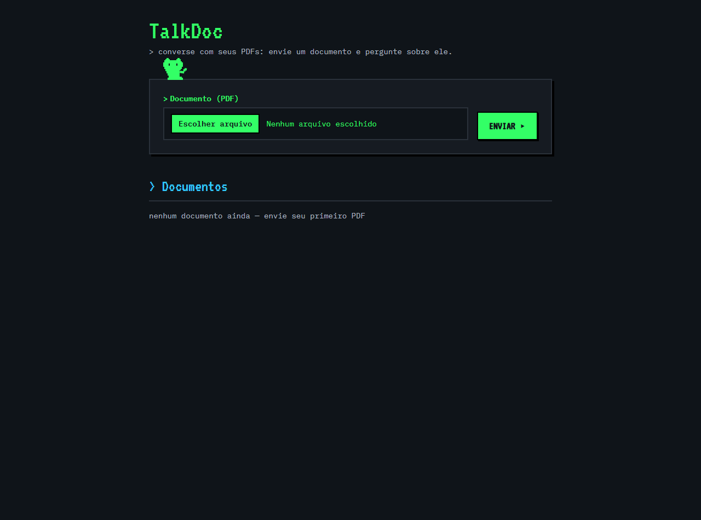
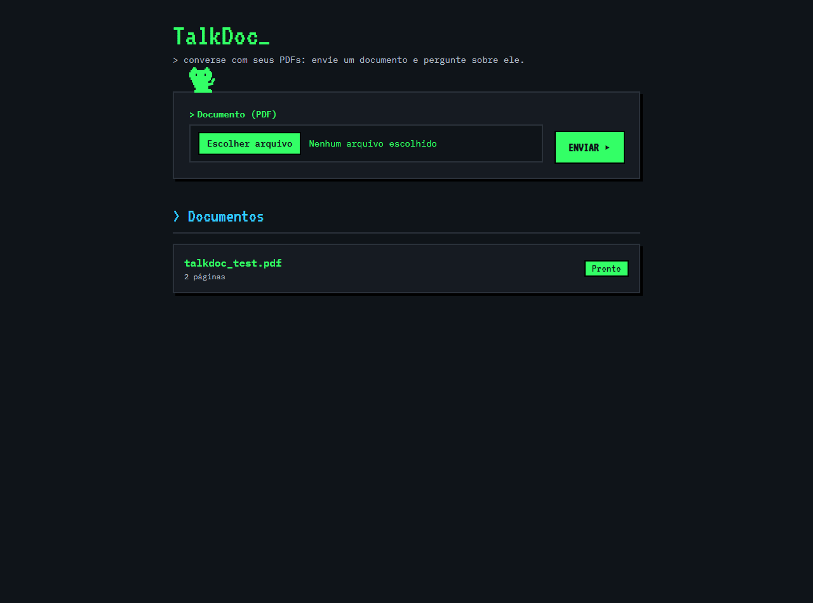
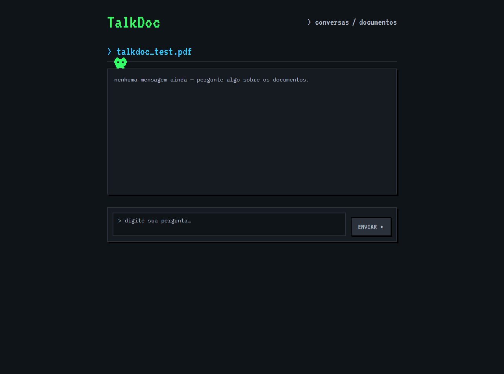
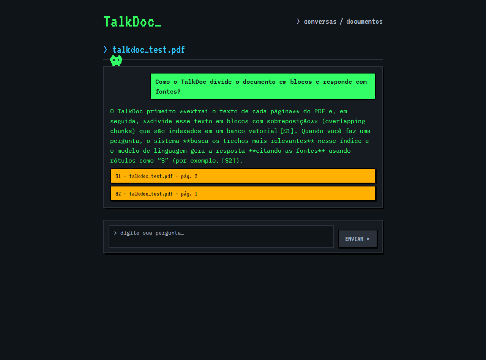

# TalkDoc

Assistente de conversa sobre PDFs: envie documentos, faça perguntas e receba respostas com citação das fontes (S1, S2, S3…).


## O que é

O TalkDoc extrai o texto de cada página do PDF, divide em blocos com sobreposição, indexa num banco vetorial (Qdrant) e, a cada pergunta, recupera os 5 trechos mais relevantes (corte de similaridade 0.3). O modelo responde fundamentado nesses trechos e rotula cada fonte, o que vira um card clicável com o trecho citado e a página.

Stack: FastAPI (backend) + React/Vite/Tailwind (frontend) + Qdrant (vetores) + SQLite (metadados e conversas) + Docker Compose (infra inteira). Embeddings com Google Gemini (`gemini-embedding-001`, 768 dimensões), chat com Groq (`openai/gpt-oss-120b`) em streaming SSE.

## Arquitetura



O frontend conversa com o backend via nginx (produção) ou proxy do Vite (desenvolvimento). O backend expõe três grupos de rotas: `/documents` (upload, status, listagem), `/conversations` (criar, listar, mensagens) e `/conversations/{id}/chat` (SSE: evento de referências primeiro, depois os tokens, `done` no fim).

O processamento acontece em background: extração com PyMuPDF, chunking por palavras (~800 tokens, 15% de sobreposição, sem cruzar páginas), embeddings em lote de 100 e upsert no Qdrant. Conversas e mensagens (com as referências em JSON) ficam no SQLite.

## Como rodar

Pré-requisitos: Docker e Docker Compose.

```bash
git clone https://github.com/Gustavo-Pereira270805/talkdoc.git
cd talkdoc
cp .env.example .env   # preencha GROQ_API_KEY e GEMINI_API_KEY
docker compose up -d --build
```

- Frontend: http://localhost:8080
- API: http://localhost:8000 (health em `/health`)

O compose sobe Qdrant, aplica o migrate (cria o schema, uma vez) e inicia backend e frontend. As chaves entram pelo `.env` e não vão para o git; sem elas a aplicação sobe, mas o pipeline RAG não funciona.

### Desenvolvimento

```bash
# backend
cd backend
python -m venv .venv
.venv/Scripts/pip install --group dev .     # Windows
.venv/Scripts/python -m pytest              # 31 testes
.venv/Scripts/ruff check .
.venv/Scripts/mypy app

# frontend
cd frontend
npm install
npm run dev        # Vite em :5173 com proxy para :8000
npm test           # 25 testes (Vitest + Testing Library)
npm run lint       # ESLint
npm run format:check  # Prettier
```

O CI (GitHub Actions) roda todos esses checks em push e PR para `main`; o `main` exige os checks verdes para aceitar merge.

## Decisões técnicas

Cada decisão relevante tem um ADR em `docs/adr/`:

| ADR | Decisão |
|---|---|
| [0001](docs/adr/0001-monorepo-fastapi-react-docker.md) | Monorepo FastAPI + React + Docker Compose |
| [0002](docs/adr/0002-pipeline-rag-proprio-com-abstracao-de-provider.md) | Pipeline RAG próprio, com interface de provider (sem LangChain) |
| [0003](docs/adr/0003-qdrant-vector-store-sqlite-metadados.md) | Qdrant para vetores, SQLite para metadados |
| [0004](docs/adr/0004-sse-streaming-com-referencias-em-evento-inicial.md) | SSE com referências num evento inicial |
| [0005](docs/adr/0005-backgroundtasks-sem-fila-distribuida.md) | BackgroundTasks do FastAPI, sem fila distribuída |

## Limitações

- Sem autenticação: qualquer pessoa com acesso ao deploy pode enviar arquivos e ler conversas.
- PDFs escaneados (sem camada de texto) falham com mensagem clara; não há OCR.
- Upload limitado a 20 MB.
- Sem reranker: a recuperação é top-5 com corte de similaridade, o que é suficiente para documentos pequenos e médios.
- Chunking heurístico por palavras (sem tokenizer do modelo); o ponto de troca está documentado no ADR 0002.
- Modelos dependem dos free tiers da Groq e do Google; indisponibilidade vira erro limpo para o usuário.

## Uso de ferramentas de IA

O desenvolvimento foi assistido por IA (opencode) sob revisão humana, com testes escritos antes do código (TDD) e decisões registradas em `docs/session-report.md`. A identidade visual (tema de terminal escuro e o gatinho pixel) e escolhas de UX foram definidas e aprovadas pelo usuário em cada etapa. As capturas de tela abaixo foram geradas por scripts Playwright automatizados (webwright) rodando a aplicação real.

## Screenshots

Página de upload com a lista de documentos:



Documento processado (status "pronto", 2 páginas):



Conversa criada com o documento:



Resposta com referências citadas (cards S1 e S2):

